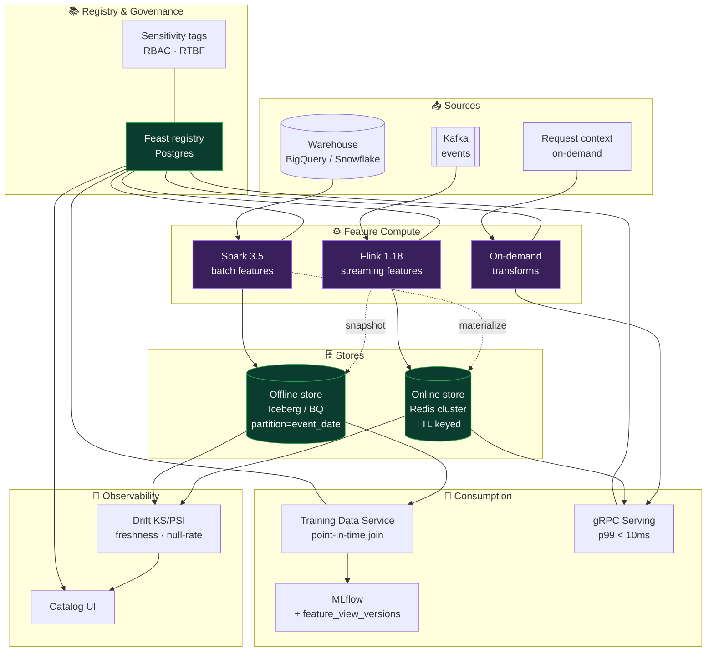
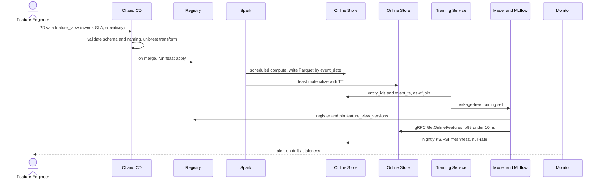

<div align="center">

# 🧊 ML Feature Store & Training Data Pipeline

**A production-grade feature platform that serves features for point-in-time-correct offline training _and_ sub-10 ms online inference — with a Git-native registry, batch + streaming + on-demand compute, drift monitoring, and PII governance.**

[](.github/workflows/ci.yml)
[](https://feast.dev)
[](pyproject.toml)
[](spark/)
[](flink/)
[](LICENSE)

</div>

---

## 1. Why this exists

A data-science org of ~30 ML engineers had four recurring failures:

| Pain | Symptom | Root cause |
|------|---------|-----------|
| **Training–serving skew** | Models silently degrade in production | Feature logic re-implemented in notebooks vs. serving |
| **No discoverability** | Teams rebuild the same features | No registry; features live in private notebooks |
| **Future leakage** | Offline metrics far better than online | Naïve joins leak post-event data into training |
| **Compliance risk** | Cannot answer "which features touch PII?" | No lineage, no sensitivity tagging |

This platform fixes all four by making the **feature definition the single source of truth**: the same transformation feeds the offline store (training) and the online store (serving), every feature carries ownership / freshness / sensitivity metadata, and every training set is built with a provably leakage-free **as-of join**.

> **One rule:** *if a feature is not in the registry, it cannot be served.*

---

## 2. Architecture



### Feature tiers (cost vs. latency)

| Tier | Engine | Freshness | Cost | Default for |
|------|--------|-----------|------|-------------|
| **real-time** | Flink | seconds | $$$ | fraud, abuse |
| **near-real-time** | Spark Structured Streaming (5-min trigger) | minutes | $$ | ranking |
| **batch** | Spark (daily/hourly) | hours | $ | most models *(default)* |

Upgrading a feature to a hotter tier requires written justification (`docs/data-contracts.md`).

---

## 3. Point-in-time correctness (the core invariant)

Training data must contain **only information available at prediction time**. Given a set of
entity / event-timestamp rows $E = \{(e_i, t_i)\}$ and a feature view with rows
$(e, t^{f}, v)$, the as-of join selects for every $(e_i, t_i)$:

$$
v^{*}(e_i, t_i) = v\Big(\arg\max_{t^{f}} \; \{\, t^{f} \;\mid\; e = e_i \;\wedge\; t^{f} \le t_i \;\wedge\; t_i - t^{f} \le \text{TTL} \,\}\Big)
$$

Two guarantees fall out of this definition:

1. **No future leakage** — the constraint $t^{f} \le t_i$ forbids any feature value created after the event.
2. **Freshness bound** — the constraint $t_i - t^{f} \le \text{TTL}$ drops values that would be stale at serving time, keeping offline and online behaviour aligned.

The implementation (`feature_platform/training/point_in_time.py`) does a backward as-of merge per
entity key and is verified by an adversarial test suite (`tests/pit_correctness/`) that injects
future-dated rows and asserts they never appear in the output.

---

## 4. Drift & monitoring math

Nightly, every feature is compared against a monthly baseline.

**Population Stability Index** over $B$ bins with expected share $p_b$ and actual share $q_b$:

$$
\mathrm{PSI} = \sum_{b=1}^{B} (q_b - p_b)\,\ln\frac{q_b}{p_b}
\qquad
\begin{cases}
< 0.1 & \text{stable} \\
0.1 - 0.2 & \text{watch} \\
> 0.2 & \text{alert}
\end{cases}
$$

**Two-sample Kolmogorov–Smirnov** statistic for numeric features:

$$
D = \sup_x \,\big| F_{\text{baseline}}(x) - F_{\text{current}}(x) \big|
$$

We alert when the KS p-value drops below `DRIFT_KS_PVALUE_THRESHOLD` (default `0.05`).

---

## 5. Data model

**Offline table** (`<feature_view>`), partitioned by `event_date`, clustered by `entity_id`:

| column | type | note |
|--------|------|------|
| `entity_id` | STRING | cluster key |
| `event_ts` | TIMESTAMP | event time (as-of key) |
| `feature_*` | various | feature columns |
| `created_ts` | TIMESTAMP | write time (for late-data audit) |
| `event_date` | DATE | partition key (derived) |

**Online key/value** — key `:`-joined, value is a TTL'd serialized struct:

```
key   = "{feature_view}:{entity_id}"          # composite: "{fv}:{e1}|{e2}"
value = msgpack({feature: value, ...})  EX 86400
```

**Training dataset** — wide: `entity_id, event_ts, feature_1 … feature_N, label`.

---

## 6. End-to-end flow



---

## 7. Repository layout

```
feature_repo/          Feast definitions (entities, sources, feature views, services) — the registry
src/feature_platform/  The platform library
  ├─ registry/         Validation (owner/SLA/naming) + feast apply sync
  ├─ offline/          Offline store adapters (BigQuery, Snowflake, Iceberg) + partitioning
  ├─ online/           Online store adapters (Redis, DynamoDB) + key schema + serialization
  ├─ batch/            Spark batch runner + transforms
  ├─ streaming/        Kafka source, windowing, online sink, offline snapshot
  ├─ ondemand/         On-demand feature execution
  ├─ training/         Point-in-time join + training dataset builder
  ├─ serving/          Feature resolver for the gRPC layer
  ├─ monitoring/       Drift (KS/PSI), freshness, null-rate, skew, baselines, alerts
  ├─ governance/       Sensitivity tagging, RBAC, right-to-be-forgotten, audit
  ├─ backfill/         Idempotent parameterized backfills + run state
  ├─ mlflow_integration/  Pin feature_view_versions to runs
  └─ dq/               Great Expectations feature checks
services/
  ├─ serving_grpc/     gRPC server + protobuf
  ├─ ondemand_api/     FastAPI on-demand transform service
  └─ catalog_ui/       Feature discovery web portal
spark/   flink/        Engine jobs
pipelines/airflow/     Orchestration DAGs
infra/                 SQL DDL, Terraform, k8s
monitoring/            Grafana dashboards, Prometheus alerts
docs/                  Architecture, ADRs, runbooks, guides
tests/                 unit / integration / pit_correctness
```

---

## 8. Quickstart

```bash
# 0. clone + deps
make dev

# 1. bring up the local stack (redis, kafka, postgres, mlflow)
make up

# 2. register feature definitions
make feast-apply

# 3. compute batch features + push to the online store
make backfill FV=user_features START=2026-04-01 END=2026-06-01
make materialize

# 4. build a point-in-time-correct training set
python examples/build_training_dataset.py

# 5. serve features online (gRPC, p99 < 10ms)
python -m services.serving_grpc.server

# 6. nightly drift monitor
make monitor
```

---

## 9. Operations

| Concern | Where |
|---------|-------|
| Feature staleness | `docs/runbooks/feature-staleness.md` |
| Online store outage | `docs/runbooks/online-store-outage.md` |
| Backfill request | `docs/runbooks/backfill.md` + `scripts/run_backfill.py` |
| Right-to-be-forgotten | `feature_platform.governance.rtbf` |
| Architecture decisions | `docs/adr/` |

SLOs: online read **p99 < 10 ms**, feature **freshness within view SLA**, training-serving **skew score < 0.1**.

---

## 10. Skills demonstrated

Feast architecture & SDK · point-in-time correctness · Spark batch features · Flink streaming
features · Redis/DynamoDB online stores · BigQuery/Snowflake/Iceberg offline stores · MLflow ↔
registry interplay · drift detection (KS/PSI) · cross-team data contracts & governance · cost
economics of ML platforms.

## 11. Roadmap

- [ ] Embedding features + vector store (pgvector / Milvus)
- [ ] Self-serve feature exploration UI with profiling
- [ ] Real-time backfills via stream replay
- [ ] Federated feature sharing with row-level governance

---

<div align="center">
<sub>Built by <a href="https://github.com/PSURI1894">Parth Suri</a> · MIT licensed · contributions welcome (see <a href="CONTRIBUTING.md">CONTRIBUTING</a>)</sub>
</div>
